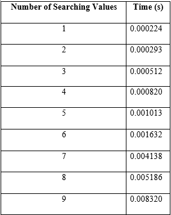

# EC7207 - High Performance Computing

# Project Analysis Report

# PARALLEL SEARCH QUERY FOR DATABASE RECORDS USING OPENMP, MPI AND HYBRID
---
## 1.	PROJECT OVERVIEW

### 1.1 Background & Motivation

In modern data driven applications, querying large scale databases efficiently is critical for performance. Traditional serial approaches often become bottlenecks when dealing with high-frequency or bulk search operations. This project focuses on designing and implementing a parallel search system for querying records in a PostgreSQL database, using three approaches,

1.	OpenMP for multi-threaded execution
2.	MPI for distributed execution across multiple processes
3.	Hybrid model combining both OpenMP and MPI

Each approach is evaluated by performing searches for specific UserId values in a PostgreSQL dataset. The goal is to observe how each parallelization method affects execution time. This implementation provides insight into high performance computing strategies for database query tasks and demonstrates the tradeoffs between overhead and parallel speedup.

#### 1.1.1	Project Goals
- Implement and compare different parallel approaches (OpenMP, MPI, and hybrid) for searching specific values in a relational database.
- To reduce query response time when handling multiple search values by distributing the workload efficiently.
-	To identify limitations of parallel approaches in database environments, particularly related to overhead, thread/process management, and connection handling.

#### 1.1.2	Dataset and Environment Setup
-	A PostgreSQL database was created using a real world dataset containing Amazon product reviews.
-	Each record includes fields like Id, ProductId, UserId, ProfileName, HelpfulnessNumerator, HelpfulnessDenomenator, Score, Time, Summary, Text etc.
-	A PostgreSQL database was configured locally.
-	The reviews table was created with appropriate datatypes.
-	C programs were connected to the PostgreSQL database using the libpq C API.
- Dataset Link
https://www.kaggle.com/datasets/jillanisofttech/amazon-product-reviews


---
## 2.	METHODOLOGY

## 2.1.1	Serial Version

The serial implementation performs sequential UserID based searches on a PostgreSQL database using the C `libpq` API. It accepts multiple UserIds as command line arguments, connects to the database, and executes a `SELECT` query for each value. The results, including all review details, are printed to the console one by one. A single database connection is reused throughout the process. Execution time is measured using the `clock()` function to evaluate total runtime.


## 2.1.2 OpenMP Parallel 

This OpenMP based implementation performs parallel searching of multiple `UserId`s in a PostgreSQL database. It accepts `UserId`s as command line arguments and launches multiple threads using OpenMP, where each thread handles one search independently. Each thread establishes a separate database connection, executes a query, and prints the matching records along with its thread ID. Execution time is measured using `omp_get_wtime()` to evaluate performance.


## 2.1.3	MPI Version

This MPI based implementation performs parallel search queries across multiple PostgreSQL database records using process level parallelism. It accepts `UserId`s as command line arguments and distributes them among MPI processes, where each process independently connects to the database and searches for one assigned `UserId`. Query results are printed along with the process rank. Execution time is measured using `MPI_Wtime()`, and global performance is evaluated by reducing start and end times across all processes.


## 2.1.4	Hybrid Version

This hybrid implementation combines MPI and OpenMP to perform parallel database searches across both processes and threads. MPI processes are assigned chunks of `UserId`s, which are further distributed among OpenMP threads within each process. Each thread establishes its own PostgreSQL connection, executes the query, and prints results alongside the process and thread identifiers. Execution time is measured using `MPI_Wtime()` and reduced across all ranks to assess total runtime.


---
## 3. Compilation & Execution

#### CSV Data Entry to PostgreSQL Database

```
gcc -o dataEntering dataEntering.c -I/usr/include/postgresql -lpq
```
```
./dataEntering Reviews.csv
```

#### Serial searching in PostgreSQL database
```
gcc -o simpleSearch simpleSearch.c -I/usr/include/postgresql -lpq
```
```
./simpleSearch "A395BORC6FGVXV" "A1MZYO9TZK0BBI"  "A1UQRSCLF8GW1T" "A21BT40VZCCYT4" "A3HDKO7OW0QNK4" "A1SP2KVKFXXRU1" "AQLL2R1PPR46X" "A10EHUTGNC4BGP" "A1Z54EM24Y40LL"
```
#### Parallel searching using OpenMP in PostgreSQL database
```
gcc -fopenmp -o parallel_scan OpenMP/Parallelization.c  -I/usr/include/postgresql -lpq
```
```
./parallel_scan "A395BORC6FGVXV" "A1MZYO9TZK0BBI" "A1UQRSCLF8GW1T" "A21BT40VZCCYT4" "A3HDKO7OW0QNK4"
```

#### Parallel searching using MPI in PostgreSQL database
```
mpicc -I/usr/include/postgresql -o mpi_search MPI/MPISearch.c -lpq
```
```
mpirun -np 5 ./mpi_search "A395BORC6FGVXV" "A1MZYO9TZK0BBI" "A1UQRSCLF8GW1T" "A21BT40VZCCYT4" "A3HDKO7OW0QNK4"
```
### Parallel searching using Hybrid MPI+OpenMP in PostgreSQL database
```
mpicc -fopenmp -o hybrid_search Hybrid/HybridSearch.c -I/usr/include/postgresql -lpq
```
```
mpirun -np 3 ./hybrid_search "A395BORC6FGVXV" "A1MZYO9TZK0BBI"  "A1UQRSCLF8GW1T" "A21BT40VZCCYT4" "A3HDKO7OW0QNK4" "A1SP2KVKFXXRU1" "AQLL2R1PPR46X" "A10EHUTGNC4BGP" "A1Z54EM24Y40LL"
```
---
## 4.	EXPERIMENTAL EVALUATION

### 4.1 Performance Summary

# Serial


# OpenMP


# MPI


# Hybird


### 4.2 Comparison

#### 4.2.1 Serial, OpenMP and MPI Comparison

#### 4.2.2 Serial and Hybrid Method Comparison


### 4.3	Speedup

The speedup of a parallel algorithm is defined as:

$$
\text{Speedup} = \frac{T_{\text{serial}}}{T_{\text{parallel}}}
$$


**Where:**

- `T_serial`: Execution time of the serial version (in seconds)  
- `T_parallel`: Execution time of the parallel version (OpenMP, MPI, or Hybrid)

#### 4.3.1 Speedup over Serial : OpenMP vs MPI


#### 4.3.2 Speedup over Serial : Hybrid


### 4.4	Observations on Execution Times

-	The serial implementation consistently shows the lowest execution time, even though it performs searches sequentially.
-	The OpenMP, MPI, and Hybrid implementations take significantly more time for small input sizes. Their speedup values (ratio of serial time to parallel time) are all less than 1, meaning those methods perform slower than serial for these cases.

#### 4.4.1	Reasons for Higher Execution Time in Parallel Models

- **Parallel Overhead**: Parallel models introduce additional overhead due to:
  - Thread/process creation and management  
  - Synchronization and communication between threads or processes  
  - Load balancing and task division logic  

- **Database Connection Bottleneck**: Each thread/process in code creates a separate PostgreSQL connection. Opening and managing multiple connections concurrently can:
  - Increase latency  
  - Overload the database  

- Cause contention or resource exhaustion, especially in OpenMP where all threads run on the same node  

- **Short Task Duration**  

- **Thread-Safety Limitation of libpq**: PostgreSQL's `libpq` library does not allow sharing a single `PGconn` connection across multiple threads. Each thread must create its own connection, as `PGconn` is **not thread safe**. Sharing a single connection can cause:
  - Race conditions  
  - Data corruption  
  - Crashes  
  - Limits on optimization and increased connection setup overhead in thread-based implementations.


---
## 5.	CONCLUSION


Parallelism is expected to improve performance, it is only effective when:
- The workload is large
- Tasks are computationally heavy
- The overhead is justified by the performance gain

In this case, the task granularity is too fine, and the overhead dominates, resulting in longer times for OpenMP, MPI, and Hybrid compared to serial execution.
In this case, the task (searching by UserId) is very lightweight and completes quickly. As a result, the overhead introduced by OpenMP, MPI, and Hybrid models such as creating threads/processes, managing connections, and synchronizing tasks takes more time than the actual work.
Because of this, the serial method outperformed all parallel methods for small numbers of queries. This demonstrates that parallel processing is not always faster and should only be used when the nature of the task truly benefits from it.
